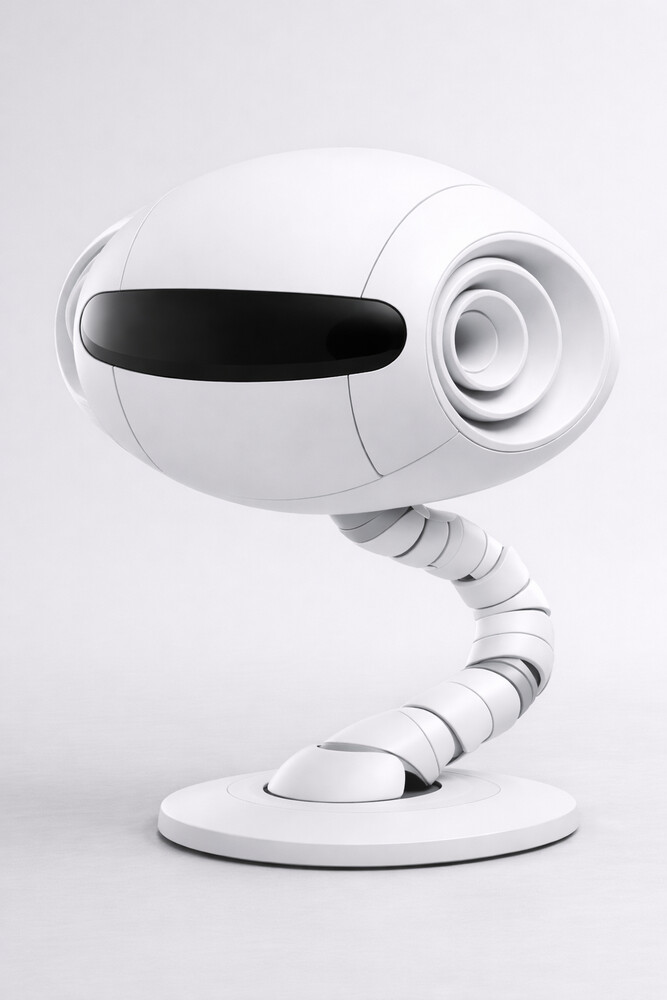

# Physicalized Agent

**A low-cost healthcare sensor head that computes bearings and ranges instead of running
inference, governs itself locally, and streams to a portal over WebTransport.** This
repository is the design system for it: the specifications, and the Claude Code skills and
MCP servers written to produce the next ones.

| | |
|---|---|
| **Status** | The sensor head is specified and not yet built. |
| **Specified** | PRD, January 2026 · functional specification, February 2026 (frozen) · bill of materials, six line items |
| **Compute** | Waveshare ESP32-P4-WIFI6: dual RISC-V at 400 MHz, 32 MB PSRAM, MIPI-CSI + DVP + I²S on chip, ESP32-C6 radio |
| **Sensors** | OV5647 (5 MP, CSI) and OV2640 (2 MP, DVP) cameras; two Knowles SPH645LM4H MEMS microphones on I²S |
| **Transport** | WebTransport over HTTP/3 (QUIC, TLS 1.3), four prioritised streams |
| **Repository** | 6 skills, 3 MCP servers (TypeScript), 3 JSON schemas. No third-party source |
| **Licence** | MIT |



*Concept render, not a built device. The horn on the flank is the acoustic geometry that
makes vertical sound localisation possible from two microphones; the segmented neck is the
tendon-driven target; the vision strip carries the stereo pair. The frozen first
specification is simpler: a two-axis gimbal outside the head.*

## Documents

Each file is as written on its date; later ones supersede earlier ones where they differ.

| Document | Date | What it fixes |
|---|---|---|
| [`docs/prd-2026-01.md`](docs/prd-2026-01.md) | January 2026 | The product: deterministic DSP over ML inference, the hybrid stereo pair, the binaural horns, the governance state machine, the four-stream transport, the acoustic enclosure |
| [`docs/functional-spec-2026-02.md`](docs/functional-spec-2026-02.md) | February 2026, frozen | The first device: sensor head only, the ESP32-P4 as the sole compute element, two cameras, two I²S microphones, two servos outside the head, one 5 V adapter into the base |
| [`docs/bom-2026-02.csv`](docs/bom-2026-02.csv) | February 2026 | Six line items against that spec, each with a manufacturer part number and datasheet |

## Where it fits

The head is the first physical device in a governance architecture that until now existed
only as software. In that architecture's vocabulary (shared with
[BROAD](https://github.com/toneron2/broad#where-it-sits)) the head is an **igent**: a device
running the edge agent stack. Every igent talks to one portal, **igent.me**, where
[URGE](https://github.com/toneron2/URGE) gates each call; **BROAD** is the first service
behind it.

```
   igent.me ── the portal: URGE verdict on every call ──▶ BROAD, service #1
       ▲ │
       │ │   Stream 0  heartbeat + governance control     bidirectional, critical
       │ │   Stream 1  XYZ vector map (JSON-LD)            high, drop old frames
       │ │   Stream 2  diagnostic audio (AAC)              medium
       │ ▼   Stream 3  video (H.264 / JPEG)                low, yields to the rest
   WebTransport over HTTP/3
       ▲ │
   Physicalized Agent ── stereo vision · binaural MEMS in horns · local state machine
```

Stream 0 carries the articulation pathway in both directions: governance control comes down
it with a verdict attached; the head's own overrides and heartbeat go up it.

**Determinism over probability.** Audio arrives as azimuth, elevation and intensity derived
from interaural time and level differences and the spectral notch cut by the horn. Vision
arrives as a rectified centroid with estimated depth. Fused, they form a 3D map, and a rule
over that map ("floor-level source above threshold") is a decision the device makes without
a model and without the network. That is what makes it inexpensive: signal processing on a
microcontroller replaces the neural accelerator an equivalent AI camera needs. The cost
target is the product requirement: a device given to the patient rather than sold to the
building.

**Two halves, bound not merged.** The software half is here: device, firmware, comms,
telemetry. The physical half (head, neck, base, horn geometry, shell, articulation) is a
separate industrial-design effort with one shared interface document. Whether the built
device gets the frozen gimbal or the tendon-driven neck is the physical half's question.

## The design system

Skills are the agents; MCP servers are the tools; JSON schemas are the contracts between
them. Claude Code is the runtime.

| Skill | Role | MCP server | Provides |
|---|---|---|---|
| `pa-conductor` | orchestration, state, conflicts | | |
| `pa-kinematics` | continuum-robot mathematics (PCC model) | `kinematics` | forward/inverse kinematics, tendon mapping |
| `pa-firmware` | ESP32 firmware | `hardware` | ESP-IDF code generation, GPIO configuration |
| `pa-mechanical` | disks, backbone, base, shell | `simulation` | motion simulation, workspace analysis |
| `pa-sensors` | camera and microphone integration, DSP | | |
| `pa-viz` | renders and plots | | |

The pipeline runs mechanical design → kinematics validation → firmware → fabrication →
test and calibration, each phase a skill, each exchange validated against
`schemas/request`, `constraint` and `result`.

**The articulated target.** The skills are written for a tendon-driven continuum neck: a
superelastic NiTi backbone, 3D-printed spacer disks, three Spectra tendons at 120°, three
NEMA 17 steppers on rack-and-pinion drives, controlled with the piecewise-constant-curvature
model (forward kinematics `T = Rz(φ)·Arc(κ,s)·Rz(−φ)`, tendon lengths
`ΔL_i = −κ·s·r·cos(φ−θ_i)`). Estimated cost about $225 for the whole system, of which
actuation is $54–69 against $270–360 for the brushless modules in OpenCR. It was deferred
in July 2026 as probably a second product; the frozen device has no neck.

## Getting started

Requires Claude Code with MCP support, Node.js 20+, and ESP-IDF 5.0+ for firmware work.

```bash
git clone https://github.com/toneron2/physicalized-agent.git && cd physicalized-agent
for s in kinematics hardware simulation; do (cd mcp-servers/$s && npm install && npm run build); done
```

Open Claude Code in the directory; the `.claude/` skills are detected. Example:
`/pa-kinematics Calculate tendon lengths for 30° bend at φ=45°`.

## References

The mechanical designs the target builds on are published by the Continuum Robotics
Laboratory as [OpenCR-Hardware](https://github.com/ContinuumRoboticsLab/OpenCR-Hardware)
(BSD 3-Clause); nothing here redistributes them. Applicability analysis:
[`PROJECT_GREENFIELD_APPLICABILITY_ANALYSIS.md`](PROJECT_GREENFIELD_APPLICABILITY_ANALYSIS.md).
Control mathematics: [tdcr-modeling](https://github.com/SvenLilge/tdcr-modeling),
[ArduinoEigen](https://github.com/hideakitai/ArduinoEigen), ESP-DSP.

- Grassmann, R. M. et al., "Open Continuum Robotics – One Actuation Module to Create them All", *Frontiers in Robotics and AI*, 2024. doi:10.3389/frobt.2024.1272403
- Rao, P. et al., "How to Model Tendon-Driven Continuum Robots and Benchmark Modelling Performance", *Frontiers in Robotics and AI*, 2021. doi:10.3389/frobt.2020.630245

## Contact

Tony Slosar · TODOMODO.IO AGENCY LLC · anthonyslosar@gmail.com · [t.me/toneron2](https://t.me/toneron2) · [slosars.me](https://slosars.me)
